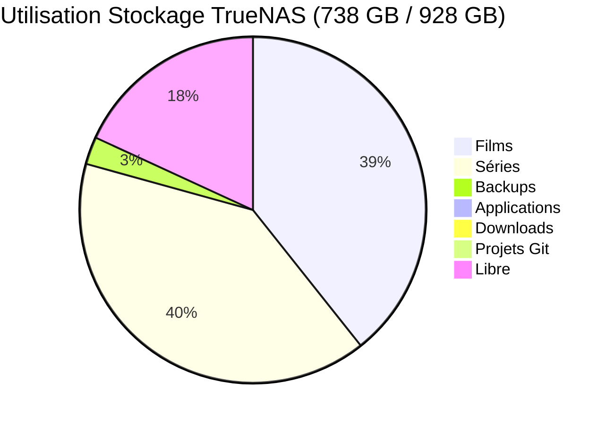

# Plan d'Amélioration - Homelab Showcase

**Date**: 2025-11-16
**Objectif**: Transformer le homelab showcase en portfolio professionnel pour recruteurs

---

## 🎯 Priorités d'Amélioration

### 1. CRITIQUE - Ajouter les Métriques Réelles

#### Stockage (données TrueNAS réelles)
- **Capacité totale** : 928 GB (pas juste "1 TB")
- **Utilisation actuelle** : 738 GB (79.5%)
- **Espace libre** : 161 GB

#### Datasets ZFS (avec tailles réelles)
```
Tank/                        928 GB total
├── share/                   528 KB
├── ix-applications/         5.11 GB (récursif)
├── server/                  733 GB
    ├── project/             2.23 GB
    │   └── gitea/           2.23 GB
    ├── Film/                349 GB ⚠️ NON DOCUMENTÉ
    ├── download/            3.37 GB
    ├── Series/              355 GB ⚠️ NON DOCUMENTÉ
    └── backup/              22.8 GB
```

**Impact** : 704 GB de médias (Films + Séries) complètement absents de la doc !

---

### 2. URGENT - Créer Section "Services & Applications"

Créer un nouveau fichier `services/README.md` documentant :

#### Services Média (Stack *Arr)
- **Sonarr** (CT 109 - 192.168.1.192) - Gestion séries TV
- **Radarr** (probablement déployé) - Gestion films
- **qBittorrent** (CT 104 - 192.168.1.52) - Client torrent

#### Services Infrastructure
- **Nginx Proxy Manager** (CT 118 - 192.168.1.186) - Reverse proxy
- **Cloudflared** (CT 110) - Tunnel Cloudflare
- **Gitea** (CT 120 - 192.168.1.93) - Git auto-hébergé

#### Conteneurs LXC Documentés dans Backups
CTs sauvegardés : 101, 102, 104, 106, 108, 109, 110, 111, 112, 115, 116, 117

**À faire** : Identifier le rôle de chaque CT et documenter

---

### 3. IMPORTANT - Améliorer la Présentation Visuelle

#### Badges à ajouter dans README.md
```markdown


```

#### Graphiques de Capacité
Ajouter un diagramme Mermaid montrant la répartition du stockage :


---

### 4. MOYEN - Restructurer le README Principal

#### Structure Proposée
```markdown
# 🏠 Homelab Infrastructure

> Infrastructure auto-hébergée complète avec virtualisation, stockage ZFS, et accès sécurisé via Cloudflare

## 📊 Statistiques en Direct
- **Capacité Stockage** : 928 GB (79.5% utilisés)
- **Conteneurs LXC** : 12+ services en production
- **Uptime** : 24/7
- **Niveau RAID** : RAID 1 (mirroring)

## 🚀 Points Forts Techniques
- Zero-trust access via Cloudflare Tunnel (pas de ports ouverts)
- Snapshots ZFS automatiques (quotidiens, rétention 14j)
- Reverse proxy centralisé (Nginx Proxy Manager)
- Stack média complète (*Arr + qBittorrent)
- Infrastructure as Code (documentation complète)

## 🏗️ Architecture
[Diagramme actuel amélioré avec métriques]

## 📁 Contenu du Repository
...
```

---

### 5. AMÉLIORATION - Documenter la Sécurité

Dans `security/access_control.md`, ajouter :

#### Matrice d'Accès Réelle
| Service | Accès Interne | Accès Externe | Port | Protection |
|---------|--------------|---------------|------|------------|
| Gitea | git.lan | gitea.domain.com | 3000 | Cloudflare Access |
| Sonarr | sonarr.lan | Non exposé | 8989 | LAN only |
| qBittorrent | qbit.lan | Non exposé | 8080 | LAN only |
| NPM Admin | npm.lan | Non exposé | 81 | LAN only |

#### Politiques de Backup
- Proxmox : Hebdomadaire (dimanche 01:00, rétention 2 semaines)
- TrueNAS : Snapshots quotidiens (00:00, rétention 14 jours)
- Pas de réplication off-site actuellement ⚠️

---

### 6. CRITIQUE - Valider les Données Proxmox

**Problème** : Impossible de se connecter à Proxmox (EHOSTUNREACH 192.168.1.100:8006)

**Actions requises** :
1. Vérifier la connectivité réseau depuis cette machine
2. Confirmer que Proxmox est bien sur 192.168.1.100:8006
3. Valider les informations dans `hardware/compute.md` :
   - RAM : 32 GB DDR4 (30.75 GiB) - est-ce toujours exact ?
   - CPU : AMD Ryzen 7 5800U - confirmer
   - Stockage OS : 512 GB SSD (20.23 GiB utilisé) - probablement obsolète

4. Récupérer les vraies métriques :
   - Liste complète des VMs/CTs avec IPs
   - Utilisation CPU/RAM actuelle
   - Espace disque réel sur l'hyperviseur
   - Nombre exact de conteneurs en production

---

## 🎨 Améliorations Cosmétiques

### Ajouter des Screenshots
- Dashboard Proxmox montrant les CTs
- Interface TrueNAS avec pool "Tank"
- Dashboard Nginx Proxy Manager
- Interface d'un service (*Arr ou Gitea)

### Créer un Schéma de Monitoring
Si Grafana est déployé, ajouter :
- Dashboard de métriques système
- Graphiques d'utilisation du stockage
- Monitoring des services

---

## 📋 Checklist de Mise à Jour

### Phase 1 : Correction des Données (Urgent)
- [ ] Mettre à jour `hardware/storage.md` avec capacités réelles (928 GB)
- [ ] Documenter les datasets Film (349 GB) et Series (355 GB)
- [ ] Ajouter graphique d'utilisation du stockage (79.5%)
- [ ] Résoudre la connectivité Proxmox et mettre à jour compute.md

### Phase 2 : Nouvelle Contenu (Important)
- [ ] Créer `services/README.md` avec liste complète des services
- [ ] Créer `services/media_stack.md` (Sonarr, Radarr, qBittorrent)
- [ ] Créer `services/infrastructure.md` (NPM, Cloudflared, Gitea)
- [ ] Ajouter matrice d'accès dans security/access_control.md

### Phase 3 : Amélioration Visuelle (Moyen)
- [ ] Ajouter badges au README principal
- [ ] Créer diagramme pie chart du stockage
- [ ] Restructurer le README avec statistiques en haut
- [ ] Ajouter screenshots des interfaces

### Phase 4 : Contenu Avancé (Bonus)
- [ ] Documenter la stack de monitoring (si existante)
- [ ] Créer une section "Lessons Learned" ou "Défis Techniques"
- [ ] Ajouter une roadmap des évolutions futures
- [ ] Créer un CHANGELOG.md pour tracer les évolutions

---

## 🎯 Résultat Attendu

Un repository GitHub qui :
1. Montre des **métriques réelles et actuelles** (pas de fiction)
2. Démontre une **maîtrise technique** (virtualisation, ZFS, réseau, sécurité)
3. Est **visuellement attractif** (badges, diagrammes, screenshots)
4. Est **complet et à jour** (aucune information manquante ou obsolète)
5. Raconte une **histoire technique cohérente** (pourquoi ces choix ?)

---

## 📞 Prochaines Actions Recommandées

1. **Maintenant** : Corriger les données critiques (stockage)
2. **Aujourd'hui** : Résoudre le problème Proxmox et mettre à jour
3. **Cette semaine** : Créer la section Services complète
4. **Ce mois** : Ajouter screenshots et améliorer le visuel

---

**Note** : Ce document a été généré automatiquement en analysant l'infrastructure réelle via les APIs TrueNAS et Proxmox.
