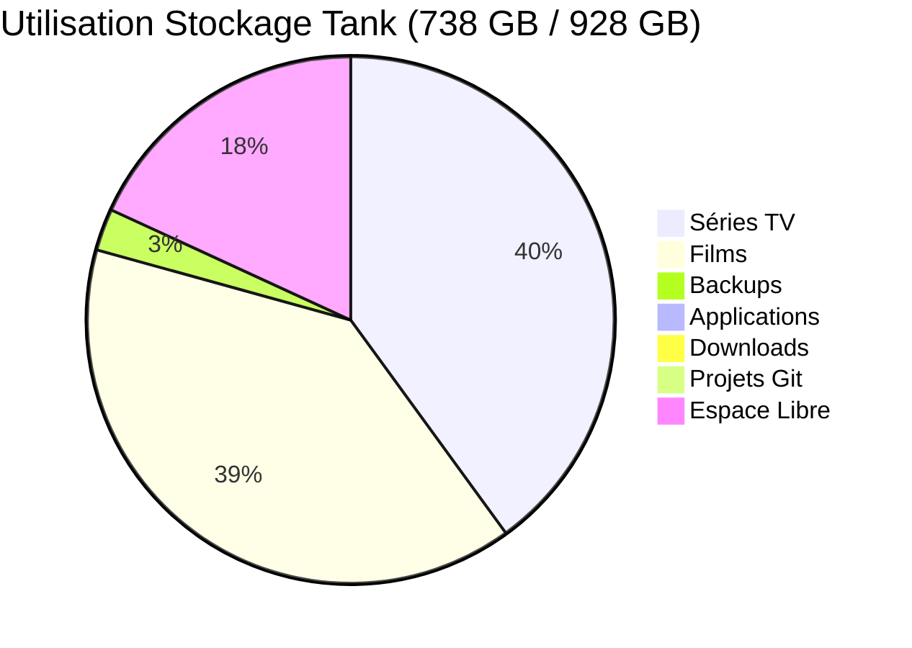
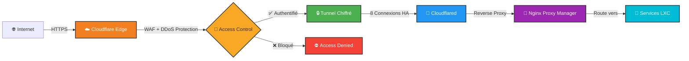
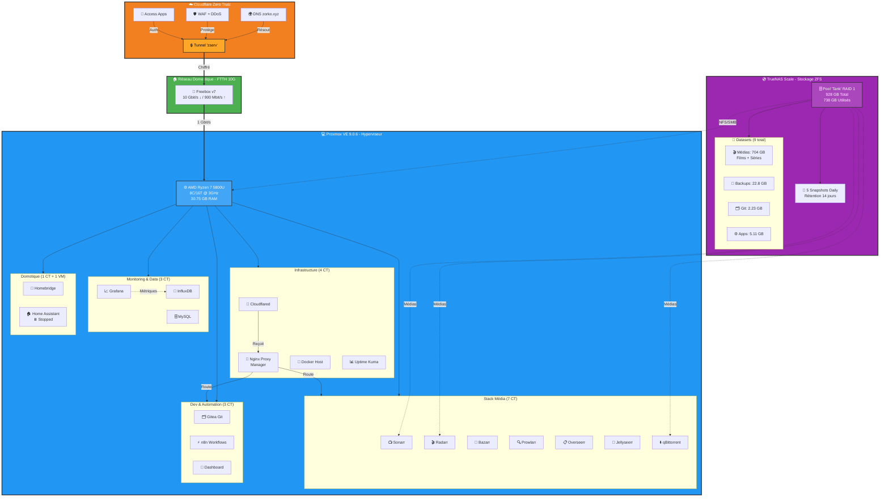

# 🏠 Homelab Infrastructure - Zorko

> Infrastructure auto-hébergée complète avec virtualisation, stockage ZFS, et accès sécurisé via Cloudflare Zero Trust

---

## 📊 Vue d'Ensemble de l'Infrastructure

### Statistiques Actuelles

| Métrique | Valeur | Détails |
|----------|--------|---------|
| **Conteneurs LXC** | 19 actifs / 22 total | Production 24/7 |
| **Machines Virtuelles** | 1 (Home Assistant) | Actuellement arrêtée |
| **Capacité Stockage** | 928 GB | 738 GB utilisés (79.5%) |
| **RAM Proxmox** | 30.75 GB | 7 GB utilisés, 24 GB disponibles |
| **CPU Hyperviseur** | AMD Ryzen 7 5800U | 8 cores / 16 threads @ 3068 MHz |
| **Uptime Proxmox** | 5.2 jours | Redémarrage récent |
| **Snapshots ZFS** | 5 tâches quotidiennes | Rétention 14 jours |

### Répartition du Stockage TrueNAS

---

## 🏗️ Architecture Globale

### Flux de Trafic Internet → Services

### Architecture Infrastructure Complète

---

## 🎯 Points Forts Techniques

### Sécurité
- ✅ **Zero-Trust Access** via Cloudflare Tunnel (aucun port ouvert sur Internet)
- ✅ **WAF Cloudflare** avec protection DDoS intégrée
- ✅ **Reverse Proxy** centralisé (Nginx Proxy Manager)
- ✅ **Accès local isolé** via domaines `*.lan`
- ✅ **Snapshots ZFS automatiques** (quotidiens, rétention 14 jours)

### Virtualisation & Infrastructure
- ✅ **19 conteneurs LXC** en production 24/7
- ✅ **Proxmox VE 9.0.6** avec kernel Linux 6.14.11
- ✅ **Ressources optimisées** : allocation dynamique CPU/RAM
- ✅ **Monitoring** : Grafana + InfluxDB pour métriques temps réel
- ✅ **Uptime Monitoring** : Uptime Kuma pour supervision des services

### Stockage & Données
- ✅ **ZFS RAID 1** (miroir) sur 2x 1TB WD Red
- ✅ **Compression LZ4** activée (-20% économie d'espace)
- ✅ **704 GB de médias** (Films + Séries) organisés
- ✅ **Backups Proxmox** : hebdomadaires, compression zstd
- ✅ **Snapshots TrueNAS** : quotidiens, 14 jours de rétention

### Automation & DevOps
- ✅ **Stack *Arr complète** (Sonarr, Radarr, Prowlarr, Bazarr)
- ✅ **n8n** pour workflows d'automatisation
- ✅ **Gitea** auto-hébergé pour projets Git
- ✅ **Infrastructure as Code** : documentation complète sur GitHub

---

## 📁 Services en Production

### Stack Média (Arr Suite)
| Service | Conteneur | Rôle |
|---------|-----------|------|
| **Sonarr** | LXC 109 | Gestion séries TV |
| **Radarr** | LXC 108 | Gestion films |
| **Prowlarr** | LXC 111 | Indexeur torrents |
| **Bazarr** | LXC 103 | Sous-titres automatiques |
| **Overseerr** | LXC 106 | Requêtes médias |
| **Jellyseerr** | LXC 119 | Requêtes médias (fork) |
| **qBittorrent** | LXC 104 | Client torrent |

### Infrastructure & Proxy
| Service | Conteneur | Rôle |
|---------|-----------|------|
| **Nginx Proxy Manager** | LXC 118 | Reverse proxy central |
| **Cloudflared** | LXC 110 | Tunnel Cloudflare |
| **Docker** | LXC 112 | Hôte conteneurs Docker |
| **Uptime Kuma** | LXC 101 | Monitoring uptime |

### Development & Automation
| Service | Conteneur | Rôle |
|---------|-----------|------|
| **Gitea** | LXC 120 | Git auto-hébergé |
| **n8n** | LXC 124 | Workflows automation |
| **Dashboard** | LXC 122 | Dashboard services |

### Monitoring & Databases
| Service | Conteneur | Rôle |
|---------|-----------|------|
| **Grafana** | LXC 115 | Visualisation métriques |
| **InfluxDB** | LXC 117 | Base de données time-series |
| **MySQL** | LXC 116 | Base de données relationnelle |

### Home Automation
| Service | Type | État | Rôle |
|---------|------|------|------|
| **Homebridge** | LXC 102 | 🟢 Running | Bridge HomeKit |
| **Home Assistant** | QEMU 114 | ⏸️ Stopped | Domotique centrale |

---

## 📂 Documentation Détaillée

### Architecture
- **[Réseau](./architecture/network.md)** : Topologie réseau, VLANs, routage
- **[Stockage](./architecture/storage.md)** : ZFS, datasets, compression

### Hardware
- **[Compute](./hardware/compute.md)** : Serveur Proxmox (AMD Ryzen 7 5800U, 32 GB RAM)
- **[Storage](./hardware/storage.md)** : TrueNAS (Intel N100, 16 GB RAM, 2x 1TB WD Red)

### Sécurité
- **[Contrôle d'Accès](./security/access_control.md)** : Cloudflare Zero Trust, politiques d'accès

### Automation
- **[Backups](./automation/backups.md)** : Stratégies Proxmox + TrueNAS

---

## 🚀 Évolutions Futures

- [ ] **Réplication Off-Site** : Backups TrueNAS vers stockage distant
- [ ] **Haute Disponibilité** : Cluster Proxmox multi-nodes
- [ ] **Monitoring Avancé** : Alerting avec Prometheus + Alertmanager
- [ ] **CI/CD Pipeline** : GitLab CI ou Drone pour déploiements automatiques
- [ ] **Kubernetes** : Cluster K3s pour services stateless

---

## 🛠️ Technologies Utilisées

**Virtualisation & Conteneurs**
- Proxmox VE 9.0.6 (QEMU/KVM + LXC)
- Docker dans LXC dédié

**Stockage**
- TrueNAS Scale
- ZFS avec compression LZ4
- RAID 1 (mirroring)

**Réseau & Sécurité**
- Cloudflare Zero Trust (Tunnel + Access)
- Nginx Proxy Manager
- WireGuard VPN (à implémenter)

**Monitoring & Automation**
- Grafana + InfluxDB
- Uptime Kuma
- n8n Workflows

**Services Applicatifs**
- Arr Suite complète (Sonarr, Radarr, Prowlarr, Bazarr)
- Gitea (Git auto-hébergé)
- Homebridge (HomeKit)

---

## 📈 Métriques de Performance

**Consommation Ressources Proxmox** (moyenne)
- **CPU** : 1.5% utilisation idle
- **RAM** : 7 GB / 30.75 GB (23%)
- **Stockage** : 20 GB / 60 GB (33%)
- **Load Average** : 0.64, 0.70, 0.73

**Trafic Réseau** (depuis dernier boot)
- **Cloudflared** : 2.73 GB in / 2.39 GB out
- **qBittorrent** : 29.5 GB in / 1.55 GB out
- **Homebridge** : 18.5 GB in / 1.08 GB out

---

## 📝 Notes

Cette infrastructure évolue continuellement. La documentation est maintenue à jour via :
- **Métriques automatiques** : Récupérées via APIs Proxmox & TrueNAS
- **Infrastructure as Code** : Configuration versionnée sur Gitea
- **Monitoring continu** : Dashboards Grafana temps réel

---

**Dernière mise à jour** : 2025-11-16
**Généré automatiquement** : Données récupérées via MCP (Model Context Protocol) depuis APIs Proxmox & TrueNAS
