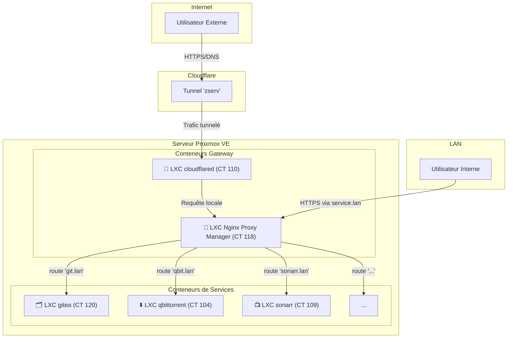

# Architecture Réseau

Ce document détaille la topologie réseau du homelab, incluant les flux de trafic externes et internes.

## Diagramme des Flux Réseau

Ce diagramme illustre comment les utilisateurs accèdent aux services, que ce soit depuis Internet ou depuis le réseau local.

## Description des Flux

### 1. Flux Externe (via Cloudflare Tunnel)

L'accès depuis l'extérieur est entièrement géré par Cloudflare pour une sécurité maximale.

1.  L'**Utilisateur Externe** accède à un service via un nom de domaine public (ex: `gitea.tondomaine.com`).
2.  **Cloudflare** prend en charge la requête : le DNS résout vers le réseau Cloudflare, et le WAF analyse le trafic.
3.  Le **Tunnel Cloudflare** achemine la requête de manière sécurisée jusqu'au conteneur `cloudflared` (CT 110) dans le homelab. Aucun port n'est ouvert sur le routeur.
4.  Le conteneur `cloudflared` transmet ensuite la requête au service de destination, qui est souvent le **Nginx Proxy Manager** pour une gestion centralisée.

### 2. Flux Interne (via Nginx Proxy Manager)

L'accès sur le réseau local est simplifié et sécurisé par le Nginx Proxy Manager (NPM).

1.  L'**Utilisateur Interne** accède à un service via un nom de domaine local en `.lan` (ex: `git.lan`).
2.  La requête est dirigée vers le **Nginx Proxy Manager** (CT 118, sur l'IP `192.168.1.186`).
3.  NPM gère le certificat SSL (pour le HTTPS en local) et agit comme un *reverse proxy*.
4.  Il redirige la requête vers le conteneur ou la machine virtuelle hébergeant le service demandé (ex: vers le conteneur `gitea` sur `192.168.1.93`).
