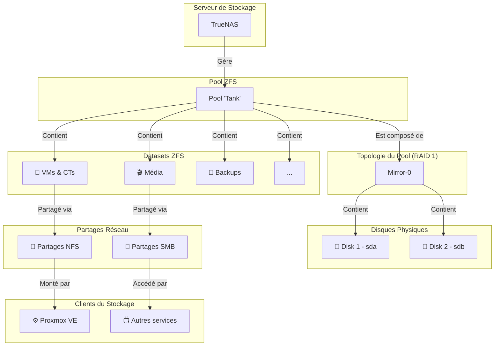

# Architecture de Stockage

Le stockage du homelab est centralisé sur un serveur dédié tournant sous TrueNAS CORE, utilisant le système de fichiers ZFS pour sa résilience et ses fonctionnalités avancées.

## Diagramme de Stockage (TrueNAS)

## Stratégie de Stockage

*   **Serveur Centralisé** : Un serveur TrueNAS unique gère tout le stockage, ce qui simplifie la gestion, la sauvegarde et la protection des données.
*   **ZFS et Redondance** : Le pool principal `Tank` est configuré en miroir (équivalent RAID 1). Toutes les données écrites sur le pool sont dupliquées sur deux disques physiques. Cela garantit qu'aucune donnée n'est perdue en cas de défaillance d'un des deux disques.
*   **Datasets** : Le pool est organisé en plusieurs datasets ZFS. Chaque dataset peut avoir ses propres règles de snapshots, de quotas et de permissions. C'est utilisé pour séparer logiquement les différents types de données (VMs, médias, backups, etc.).
*   **Partages Réseau** :
    *   **NFS** est principalement utilisé pour fournir du stockage à l'hyperviseur Proxmox. C'est là que les disques virtuels des VMs et des conteneurs sont stockés.
    *   **SMB** (Samba/CIFS) est utilisé pour les partages de fichiers plus classiques, accessibles par les services (comme Sonarr/Radarr pour les médias) ou directement par les utilisateurs sur le réseau local.
*   **Snapshots** : Des tâches de snapshots ZFS sont probablement configurées pour créer des instantanés réguliers des datasets critiques, permettant une restauration rapide en cas d'erreur humaine ou de corruption de données.
