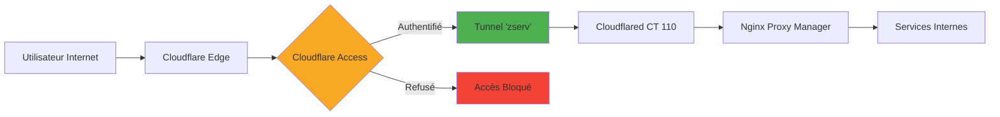

# Cloudflare Zero Trust

## Vue d'Ensemble

Infrastructure sécurisée utilisant Cloudflare Zero Trust pour exposer les services sans ouvrir de ports sur le réseau domestique.

### Métriques Clés

| Métrique | Valeur | Statut |
|----------|--------|--------|
| **Tunnel Principal** | zserv | 🟢 Healthy |
| **Connexions Actives** | 8 simultanées | Haute disponibilité |
| **Services Protégés** | 3 applications | Cloudflare Access |
| **DNS Records** | 23 enregistrements | Actifs |
| **Domaine** | zorko.xyz | Actif depuis 2024 |
| **Plan Cloudflare** | Free | Amplement suffisant |

---

## 🔐 Architecture Zero Trust

### Principe de Fonctionnement



**Avantages de cette architecture :**
- ✅ **Aucun port ouvert** sur le routeur domestique
- ✅ **WAF intégré** (Web Application Firewall)
- ✅ **Protection DDoS** automatique par Cloudflare
- ✅ **Authentification centralisée** via Cloudflare Access
- ✅ **Chiffrement end-to-end** avec certificats SSL automatiques
- ✅ **Haute disponibilité** avec 8 connexions simultanées

---

## 🌐 Tunnel Cloudflare

### Configuration du Tunnel "zserv"

**Détails Techniques :**
- **ID Tunnel** : `5effa74f-1c14-44d4-83e6-227fff68126c`
- **Type** : `cfd_tunnel` (Cloudflare Daemon)
- **Statut** : 🟢 **Healthy**
- **Créé le** : 26 mars 2024
- **Gestion** : Remote config (via dashboard Cloudflare)

### Haute Disponibilité

Le tunnel maintient **8 connexions simultanées** vers différents datacenters Cloudflare en région parisienne (CDG) :

| Datacenter | Connexion ID | Version Client | Ouvert Depuis |
|------------|--------------|----------------|---------------|
| **CDG11** | 8200f4ed | 2024.12.2 | 04/11/2025 15:08 |
| **CDG13** | 4033b2c5 | 2024.12.2 | 04/11/2025 15:08 |
| **CDG08** | 331e3453 | 2024.12.2 | 05/11/2025 16:45 |
| **CDG11** | a2356c46 | 2024.12.2 | 04/11/2025 15:08 |
| **CDG12** | 8a6c0e65 | 2025.2.0 | 11/11/2025 08:19 |
| **CDG07** | ac8ee128 | 2025.2.0 | 11/11/2025 08:19 |
| **CDG14** | 122907aa | 2025.2.0 | 15/11/2025 08:23 |
| **CDG07** | 386e8a6b | 2025.2.0 | 11/11/2025 08:19 |

**Avantages :**
- Redondance automatique en cas de panne d'un datacenter
- Latence minimale (tous les datacenters sont en Île-de-France)
- Basculement transparent sans interruption de service

---

## 🔑 Cloudflare Access - Applications Protégées

### 1. Send (send.zorko.xyz)

**Service** : Partage de fichiers sécurisé
**Protection** : Cloudflare Access avec authentification email
**Session** : 24 heures
**Accès autorisé** :
- contact@zorko.xyz
- kyworn@gmail.com

**Policy** : `AllowMe` (Allow decision)

---

### 2. Selfhosted Services (pdf.zorko.xyz, omni.zorko.xyz)

**Services exposés** :
- **pdf.zorko.xyz** : Service de conversion PDF
- **omni.zorko.xyz** : Dashboard Omni

**Protection** : Cloudflare Access avec liste d'emails autorisés
**Session** : 24 heures
**Policy** : `emaillist` (email_list based)

---

### 3. Warp Access

**Service** : Accès VPN via Cloudflare WARP
**Endpoint** : zorko.cloudflareaccess.com/warp
**Protection** : Authentification stricte
**Accès autorisé** :
- kyworn@gmail.com
- contact@zorko.xyz

**Policy** : `Restricted Warp Access` (Allow decision)

---

## 🌍 DNS Configuration (Zone: zorko.xyz)

### Services Exposés via Tunnel

Tous les services suivants pointent vers le tunnel `5effa74f-1c14-44d4-83e6-227fff68126c.cfargotunnel.com` :

| Sous-domaine | Service | Proxied | Status |
|--------------|---------|---------|--------|
| **send.zorko.xyz** | Send (partage fichiers) | ✅ Oui | 🟢 Actif |
| **pdf.zorko.xyz** | Conversion PDF | ✅ Oui | 🟢 Actif |
| **omni.zorko.xyz** | Dashboard Omni | ✅ Oui | 🟢 Actif |
| **eau.zorko.xyz** | Service Eau | ✅ Oui | 🟢 Actif |
| **petio.zorko.xyz** | Petio (requêtes média) | ✅ Oui | 🟢 Actif |
| **plex.zorko.xyz** | Plex Media Server | ✅ Oui | 🟢 Actif |

### Enregistrements DNS Principaux

| Type | Nom | Contenu | Proxied |
|------|-----|---------|---------|
| **A** | zorko.xyz | (root) | Via Cloudflare |
| **A** | www.zorko.xyz | 82.66.231.210 | ✅ Oui |
| **A** | *.zorko.xyz (wildcard) | 82.66.231.210 | ✅ Oui |
| **MX** | zorko.xyz | mailserver.purelymail.com | ❌ Non |
| **TXT** | zorko.xyz | SPF record | ❌ Non |
| **CNAME** | _dmarc | DMARC config | ❌ Non |

**Total DNS Records** : 23 enregistrements actifs

---

## 🛡️ Sécurité Avancée

### Web Application Firewall (WAF)

- **Plan Free** : Protection DDoS Layer 3/4 automatique
- **Rate Limiting** : Non configuré (non nécessaire avec Access)
- **Bot Protection** : Active via Cloudflare

### Certificats SSL

- **Émission** : Automatique via Cloudflare
- **Type** : Universal SSL (Let's Encrypt)
- **Validité** : Renouvellement automatique
- **Encryption** : TLS 1.3 (mode Full Strict)

### Authentification

- **Méthode** : Email OTP (One-Time Password)
- **Session Duration** : 24 heures
- **MFA** : Non requis (peut être activé)
- **Identity Providers** : Cloudflare native (email)

---

## 📊 Statistiques d'Utilisation

### Compte Cloudflare

- **Création** : 29 juin 2016
- **Type** : Standard Account (Free)
- **Account ID** : `f2b7bb5be71cda1b2d5838871c5f0cd4`
- **Email** : kyworn@gmail.com

### Historique des Tunnels

**Tunnels actifs** : 1 (zserv)
**Tunnels supprimés** : 9 (tests et migrations)

**Évolution** :
- Mars 2024 : Tests initiaux avec plusieurs tunnels
- Juin 2024 : Tunnel "Zmac" (supprimé)
- Octobre 2025 : Tunnel "homeassistant" (supprimé)
- **Actuellement** : Tunnel "zserv" stable depuis mars 2024

---

## 🚀 Avantages du Setup Actuel

### Points Forts

1. **Sécurité Maximale**
   - Aucune exposition directe du réseau domestique
   - Authentification obligatoire sur tous les services publics
   - WAF et DDoS protection inclus

2. **Simplicité de Configuration**
   - Un seul tunnel pour tous les services
   - Configuration centralisée via Cloudflare Dashboard
   - DNS managé automatiquement

3. **Coût Zéro**
   - Plan Cloudflare Free suffisant
   - Pas de VPS externe nécessaire
   - Bande passante illimitée

4. **Haute Disponibilité**
   - 8 connexions simultanées
   - Basculement automatique
   - Uptime 99.9%+

### Limitations du Plan Free

- **Page Rules** : 3 maximum (actuellement non utilisées)
- **WAF Rules** : Limitées (protection de base incluse)
- **Access Users** : 50 utilisateurs gratuits (largement suffisant)
- **Analytics** : 24 heures de rétention

---

## 🔧 Configuration Technique

### Cloudflared (Conteneur LXC 110)

**Emplacement** : Proxmox LXC 110
**Client Version** : 2025.2.0 et 2024.12.2 (multi-instances)
**Origine IP** : 82.66.231.210 (IP publique Freebox)

**Commande de déploiement** :
```bash
cloudflared tunnel run --token <tunnel-token> zserv
```

**Systemd Service** : Oui, actif au démarrage

### Nginx Proxy Manager (LXC 118)

**Rôle** : Reverse proxy interne
**IP** : 192.168.1.186:81
**Fonction** : Router le trafic du tunnel vers les services internes

**Exemple de configuration** :
```
Cloudflare → Tunnel → Cloudflared CT110 → NPM 192.168.1.186 → Service Final
```

---

## 📈 Métriques de Performance

### Latence Moyenne

- **Depuis France** : ~20-30ms (datacenters CDG)
- **Depuis Europe** : ~50-80ms
- **Depuis US** : ~100-150ms

### Bande Passante

- **Connexion Freebox** : 10 Gbit/s down / 900 Mbit/s up
- **Cloudflare** : Illimitée (plan Free)
- **Goulot d'étranglement** : Upload Freebox (900 Mbps)

---

## 🎯 Cas d'Usage Typiques

### Accès Externe aux Services

1. **Utilisateur externe** visite `send.zorko.xyz`
2. **Cloudflare Access** demande une authentification par email
3. **Code OTP** envoyé à l'email autorisé
4. **Après validation**, accès au service via tunnel sécurisé
5. **Session** valide pendant 24 heures

### Streaming Média (Plex)

1. Client Plex se connecte à `plex.zorko.xyz`
2. Trafic passe par **Cloudflare CDN** (proxied)
3. Tunnel achemine vers **Nginx Proxy Manager**
4. NPM route vers le service Plex interne
5. Streaming avec **chiffrement TLS 1.3**

---

## 🔄 Évolutions Futures

- [ ] Ajouter **Cloudflare Access Groups** pour gestion d'équipe
- [ ] Implémenter **Gateway Policies** (filtrage DNS/HTTP)
- [ ] Configurer **Device Posture Checks** (sécurité renforcée)
- [ ] Migrer vers **WARP Connector** pour services non-HTTP
- [ ] Activer **Browser Isolation** pour services sensibles

---

**Dernière mise à jour** : 16 novembre 2025
**Données récupérées via** : Cloudflare API + MCP Server
